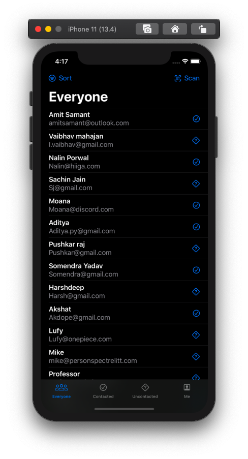

#  HotProspect

## [#100DaysOfSwiftUI](https://www.hackingwithswift.com/100/swiftui) Day [79](https://www.hackingwithswift.com/100/swiftui/79) to [85](https://www.hackingwithswift.com/100/swiftui/85) With Challenge App

### Light Mode

  
  

  
  

  
  

### Dark Mode

  
  

  
  

  
  

